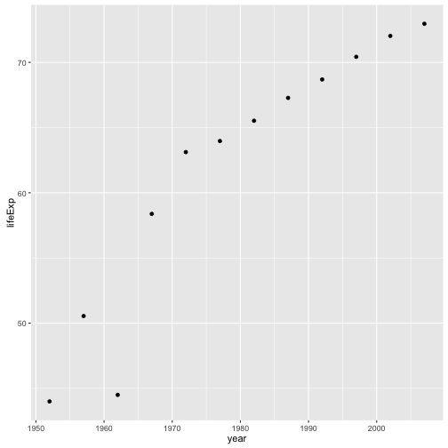
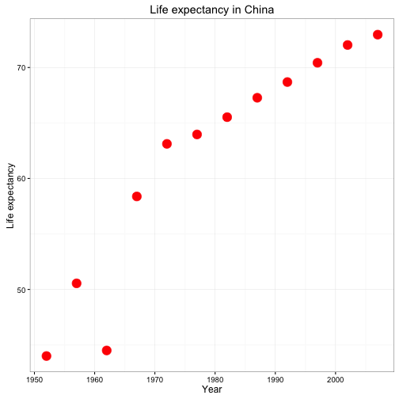
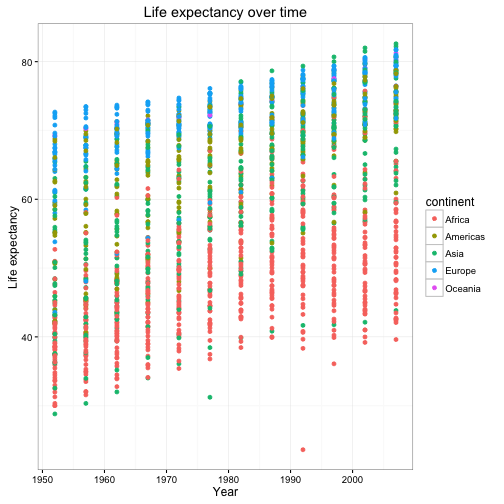
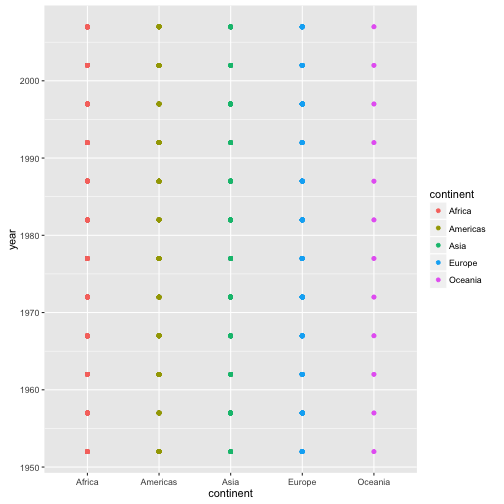
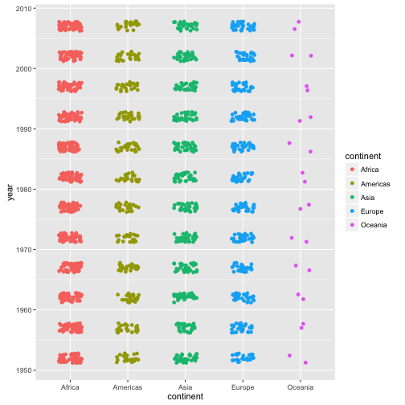
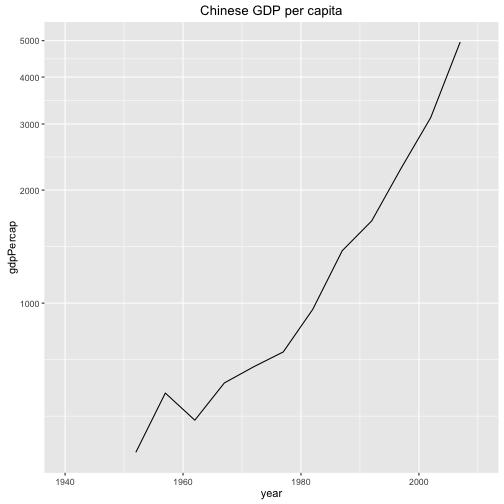
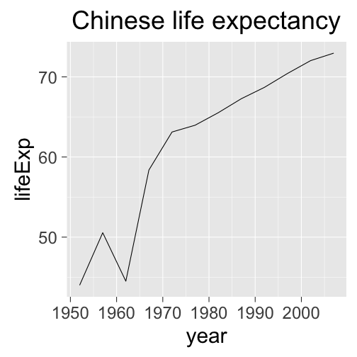

CSSS 508, Week 2
===
author: Rebecca Ferrell
date: April 6, 2016
transition: rotate
width: 1100
height: 750


Gapminder data
===

We'll be working with data from Hans Rosling's [Gapminder](http://www.gapminder.org) project. An excerpt of this data can be accessed through an R package called `gapminder`, cleaned and assembled by Jenny Bryan at UBC.

In the console: `install.packages("gapminder")` (have you set your default repository yet?)

Load the package:

```r
library(gapminder)
```


Check out gapminder
===

The data frame we will work with is called `gapminder`, available once you have loaded the package. Let's see its structure:


```r
str(gapminder)
```

```
Classes 'tbl_df', 'tbl' and 'data.frame':	1704 obs. of  6 variables:
 $ country  : Factor w/ 142 levels "Afghanistan",..: 1 1 1 1 1 1 1 1 1 1 ...
 $ continent: Factor w/ 5 levels "Africa","Americas",..: 3 3 3 3 3 3 3 3 3 3 ...
 $ year     : int  1952 1957 1962 1967 1972 1977 1982 1987 1992 1997 ...
 $ lifeExp  : num  28.8 30.3 32 34 36.1 ...
 $ pop      : int  8425333 9240934 10267083 11537966 13079460 14880372 12881816 13867957 16317921 22227415 ...
 $ gdpPercap: num  779 821 853 836 740 ...
```


What's interesting here?
===
incremental: true

* **Factor** variables `country` and `continent`: categorical data with an underlying numeric representation
* Many observations! $n=1704$ rows
* A nested/hierarchical structure: `year` in `country` in `continent`


Subsetting data
===
type: section


Installing dplyr
===
incremental: true

We'll want to be able to slice up this data frame into subsets (e.g. just the rows for Afghanistan, just the rows for 1997). We will use a package called `dplyr` to do this neatly.

In the console: `install.packages("dplyr")`

`dplyr` is a very useful and powerful package that we will talk more about soon, but today we're just going to use it for "filtering" data.


Loading dplyr
===


```r
library(dplyr)
```

```

Attaching package: 'dplyr'

The following objects are masked from 'package:stats':

    filter, lag

The following objects are masked from 'package:base':

    intersect, setdiff, setequal, union
```


Wait, was that an error?
===
incremental: true

When you load packages in R that have functions sharing the same name as functions you already have, the more recently loaded package trumps the previous ones ("masks").

This **message** is just letting you know that. To avoid this in your R Markdown file, add `message=FALSE` to your chunk options when loading packages.

Sometimes you may get a **warning message**, often if you aren't running the latest version of R:
```
Warning message:
package ‘gapminder’ was built under R version 3.2.3 
```
Chunk option `warning=FALSE` will hide this.


Filtering data frames
===


```r
gapminder %>% filter(country == "Afghanistan")
```

```
Source: local data frame [12 x 6]

       country continent  year lifeExp      pop gdpPercap
        (fctr)    (fctr) (int)   (dbl)    (int)     (dbl)
1  Afghanistan      Asia  1952  28.801  8425333  779.4453
2  Afghanistan      Asia  1957  30.332  9240934  820.8530
3  Afghanistan      Asia  1962  31.997 10267083  853.1007
4  Afghanistan      Asia  1967  34.020 11537966  836.1971
5  Afghanistan      Asia  1972  36.088 13079460  739.9811
6  Afghanistan      Asia  1977  38.438 14880372  786.1134
7  Afghanistan      Asia  1982  39.854 12881816  978.0114
8  Afghanistan      Asia  1987  40.822 13867957  852.3959
9  Afghanistan      Asia  1992  41.674 16317921  649.3414
10 Afghanistan      Asia  1997  41.763 22227415  635.3414
11 Afghanistan      Asia  2002  42.129 25268405  726.7341
12 Afghanistan      Asia  2007  43.828 31889923  974.5803
```

Logical operators
===
incremental: true

We used `==` for testing "equals": `country == "Afghanistan"`. We can also use other operators:

* `!=`: not equal to
* `>`, `>=`, `<`, `<=`: less than, less than or equal to, etc.
* `%in%`: used with checking equal to one of several values

Or we can combine multiple logical conditions:

* `&`: both conditions need to hold (AND)
* `|`: at least one condition needs to hold (OR)


Multiple conditions example
===
incremental: true


```r
gapminder %>%
    filter( (country == "Afghanistan") &
                (year > 1980) & (year <= 2000) )
```

```
Source: local data frame [4 x 6]

      country continent  year lifeExp      pop gdpPercap
       (fctr)    (fctr) (int)   (dbl)    (int)     (dbl)
1 Afghanistan      Asia  1982  39.854 12881816  978.0114
2 Afghanistan      Asia  1987  40.822 13867957  852.3959
3 Afghanistan      Asia  1992  41.674 16317921  649.3414
4 Afghanistan      Asia  1997  41.763 22227415  635.3414
```


Saving a subset
===

If we think a particular subset will be used repeatedly, we could assign that:


```r
China <- gapminder %>%
    filter(country == "China")
head(China, 4)
```

```
Source: local data frame [4 x 6]

  country continent  year  lifeExp       pop gdpPercap
   (fctr)    (fctr) (int)    (dbl)     (int)     (dbl)
1   China      Asia  1952 44.00000 556263527  400.4486
2   China      Asia  1957 50.54896 637408000  575.9870
3   China      Asia  1962 44.50136 665770000  487.6740
4   China      Asia  1967 58.38112 754550000  612.7057
```


ggplot2
===
type: section


Base plots from last week
===


```r
plot(lifeExp ~ year, data = China, xlab = "Year", ylab = "Life expectancy", main = "Life expectancy in China", col = "red", cex = 3, pch = 16)
```

***

 

ggplot2
===

An alternative way of plotting many prefer (myself included) -- [though this is not without debate](http://simplystatistics.org/2016/02/11/why-i-dont-use-ggplot2/) -- uses the `ggplot2` package in R. Install it now, and then load it.


```r
library(ggplot2)
```

The core idea underlying this package is the **grammar of graphics**: we can break up elements of a plot into pieces and combine them.


Chinese life expectancy in ggplot
===
left: 60%


```r
ggplot(data = China,
       aes(x = year, y = lifeExp)) +
    geom_point()
```

***

 

Axis labels, bigger red points, no gray background
===
left: 60%


```r
ggplot(data = China,
       aes(x = year, y = lifeExp)) +
    geom_point(color = "red", size = 5) +
    xlab("Year") +
    ylab("Life expectancy") +
    ggtitle("Life expectancy in China") +
    theme_bw()
```

***

 


Color observations by some attribute
===
left: 60%


```r
ggplot(data = gapminder,
       aes(x = year, y = lifeExp, color = continent)) +
    geom_point() +
    xlab("Year") +
    ylab("Life expectancy") +
    ggtitle("Life expectancy over time") +
    theme_bw()
```

***

 


Segment observations by some attribute
===
left: 60%


```r
ggplot(data = gapminder,
       aes(x = year, y = lifeExp,
           group = country, color = continent)) +
    geom_line(alpha = 0.5) +
    facet_wrap( ~ continent) +
    xlab("Year") +
    ylab("Life expectancy") +
    ggtitle("Life expectancy over time") +
    theme_bw()
```

***

 


Layers
===

**Layers** are the components of the graph, such as:

* `ggplot()`: initializes `ggplot2` object, specifies input data
* `geom_point()`: layer of scatterplot points
* `geom_line()`: layer of lines
* `ggtitle()`, `xlab()`, `ylab()`: layer of labels
* `facet_wrap()`: layer creating separate panels stratified by some factor wrapping around
* `facet_grid()`: same idea, but can split by two variables along rows and columns (e.g. `facet_grid(gender ~ age_group)`)
* `theme_bw()`: replace default gray background with black-and-white

Layers are separated by a `+` sign. For clarity, I put each layer on a new line.

Aesthetics
===

**Aesthetics** (parts inside an `aes()`) control how the data modifies the appearance of the layers:

* `x`, `y`: $x$- and $y$-values to use
* `color`: set color of elements based on some data value
* `group`: describe which points are conceptually grouped together for the plot (often used with lines)
* `size`: set size of points/lines based on some data value


Aesthetics: "setting" vs. "mapping"
===
incremental: true

Layers take arguments to control their appearance, such as point/line colors or transparency (`alpha` between 0 and 1).

* Arguments like `color`, `size`, `linetype`, `shape`, `fill`, and `alpha` can be used directly on the layers (**setting aesthetics**), e.g. `geom_point(color = "red")`. See the [`ggplot2` documentation](http://docs.ggplot2.org/current/vignettes/ggplot2-specs.html) for options. These don't depend on the data.

* Arguments inside `aes()` (**mapping aesthetics**) will depend on the data, e.g. `geom_point(aes(color = continent))`.

* `aes()` in the `ggplot()` layer sets the overall aesthetics to apply to other layers, but can be changed on individual layers (including switching `x` or `y` to different variables)


Storing plots
===

We can assign a `ggplot` object to a name:


```r
lifeExp_by_year <- ggplot(data = gapminder,
       aes(x = year, y = lifeExp, color = continent)) +
    geom_point() +
    xlab("Year") +
    ylab("Life expectancy") +
    ggtitle("Life expectancy over time") +
    theme_bw()
```

The graph won't be displayed when you do this. You can show the graph using a single line of code with just the object name, or take the object and add more layers.


Showing a stored graph
===


```r
lifeExp_by_year
```

 


Adding a layer: lines connecting each country
===
left: 40%


```r
lifeExp_by_year +
    geom_line(aes(group = country))
```

***

 


Lab break!
===

Start experimenting with making some graphs in `ggplot2` of the Gapminder data. You can look at a subset of the data using `filter` to limit rows, plot different $x$ and $y$ variables, facet by a factor, etc.

Some other options:
* `geom_histogram()`, `geom_density()`, `geom_boxplot()` (see the [Cookbook for R site](http://www.cookbook-r.com/Graphs/Plotting_distributions_(ggplot2)/) for a reference)
* `geom_smooth()` for adding loess or regression lines (see the [`ggplot2` documentation](http://docs.ggplot2.org/current/geom_smooth.html))
* Install [Jeff Arnold's `ggthemes` package](https://github.com/jrnold/ggthemes), load it, and try `theme_economist()`, `theme_stata()`, `theme_excel()` instead of no theme or `theme_bw()`


Common scatterplot problem: overplotting
===
left: 40%


```r
ggplot(data = gapminder,
       aes(x = continent, y = year, color = continent)) +
    geom_point()
```

***

 


Fixing overplotting with jitter
===
left: 40%


```r
ggplot(data = gapminder,
       aes(x = continent, y = year, color = continent)) +
    geom_point(position = position_jitter(width = 0.5,
                                          height = 2))
```

***

 


Changing the axes
===

We can modify the axes in a variety of ways, such as:

* Change the $x$ or $y$ range using `xlim()` or `ylim()` layers
* Change to a logarithmic or square-root scale on either axis: `scale_x_log10()`, `scale_y_sqrt()`
* Change where the major/minor breaks are: `scale_x_continuous(breaks =, minor_breaks = )`


Axis changes
===
left: 40%


```r
ggplot(data = China,
       aes(x = year, y = gdpPercap)) +
    geom_line() +
    scale_y_log10(breaks = c(1000, 2000, 3000, 4000, 5000)) +
    xlim(1940, 2010) +
    ggtitle("Chinese GDP per capita")
```

***

 


Fonts too small?
===
left: 40%


```r
ggplot(data = China,
       aes(x = year, y = lifeExp)) +
    geom_line() +
    ggtitle("Chinese life expectancy") +
    theme_gray(base_size = 30)
```

***

 


Text and tick adjustments
===

Text size, labels, tick marks, etc. can be messed with more precisely using arguments to the `theme()` layer. Note: `theme()` is a different layer than `theme_gray()` or `theme_bw()`, which you might also be using in a previous layer. See the [`ggplot2` documentation](http://docs.ggplot2.org/current/theme.html) for details.

Examples:

* `plot.title = element_text(size = rel(2), hjust = 0)` makes the title twice as big as usual and left-aligns it
* `axis.text.x = element_text(angle = 45)` rotates $x$ axis labels
* `axis.text = element_text(colour = "blue")` makes the $x$ and $y$ axis labels blue
* `axis.ticks.length = unit(.5, "cm")` makes the axis ticks longer


Color, shape, etc. scales
===

**Scales** control how the mapped aesthetics (data-dependent) appear. `ggplot2` uses reasonable defaults, but you can modify these with a `scale_[aesthetic]_[option]()` layer where `[aesthetic]` is `color`, `shape`, `linetype`, `alpha`, `size`, `fill`, etc. and `[option]` is something like `manual`, `continuous` or `discrete` (depending on nature of the variable), or a few other variations.

Examples:
* `scale_linetype_manual()` has you manually specify the linetype for each different value
* `scale_alpha_continuous()` varies transparency over a continuous range
* `scale_color_brewer(palette = "Spectral")` uses a palette from <http://colorbrewer2.org> (great site for picking nice plot colors!)

When confused...Google it!


Legend name and manual color scales
===
left: 50%


```r
lifeExp_by_year +
    scale_color_manual(name = "Which\ncontinent\nare we\nlooking at?",
                       values = c("Africa" = "seagreen",
                                  "Americas" = "turquoise1",
                                  "Asia" = "royalblue",
                                  "Europe" = "violetred1",
                                  "Oceania" = "yellow"))
```

***

 


Customizing legends
===

You can move the legends around, flip their orientation, remove them altogether, etc. The [Cookbook for R website](http://www.cookbook-r.com/Graphs/Legends_(ggplot2)/) is my go-to for burning questions such as how to change the legend labels.


Saving ggplots
===

When you knit an R Markdown file, any plots you make are automatically saved in a folder in .png format. If you want to save another copy (perhaps of a different file type for use in a manuscript), use
`ggsave()`:


```r
ggsave("I_saved_a_file.pdf", plot = lifeExp_by_year,
       height = 3, width = 5, units = "in")
```

If you didn't manually set font sizes, these will usually come out at a reasonable size given the dimensions of your output file.

Bad/non-reproducible way: choose *Export* on the plot preview.


Additional bonus ggplot fun
===

To really wow everyone, install the [`gganimate` package](https://github.com/dgrtwo/gganimate), which adds a `frame` aesthetic:


```r
# install.packages("devtools")
# devtools::install_github("dgrtwo/gganimate")
library(gganimate)
```


Animation code
===

Note: this requires the tool [ImageMagick](http://www.imagemagick.org/script/index.php) to be installed for converting to a .gif.


```r
gdp_vs_life <- ggplot(gapminder,
                      aes(x = gdpPercap,
                          y = lifeExp,
                          size = pop,
                          color = continent,
                          frame = year)) +
    geom_point() +
    scale_x_log10() +
    theme_bw()
gg_animate(gdp_vs_life, "Lectures/animated.gif",
           ani.height = 600, ani.width = 900)
```

Animation!
===


Homework
===
type: section

Pick some relationship to look at in the Gapminder data (e.g. changes in life expectancy over time across continents) and write up a .Rmd file describing `ggplot2`. visualizations used to investigate that question. You can choose to work with a subset of the data (e.g. just African countries). Upload both the .Rmd file and the .html file to Canvas.

All titles, axes, and legends should be labelled clearly (not raw variable names). You must have at least one graph with `facet_wrap` or `facet_grid`. You must include at least one manually specified legend.

Your document should be pleasant for a peer to look at, with some organization. You must write up your observations in words as well as showing the graphs. Use chunk options `echo` and `results` to limit the code/output you show in the .html.


Grading rubric
===

* 0: Didn't turn anything in
* 1: Turned in but low effort, ignoring many directions
* 2: Decent effort, followed directions with some minor issues
* 3: Nailed it
