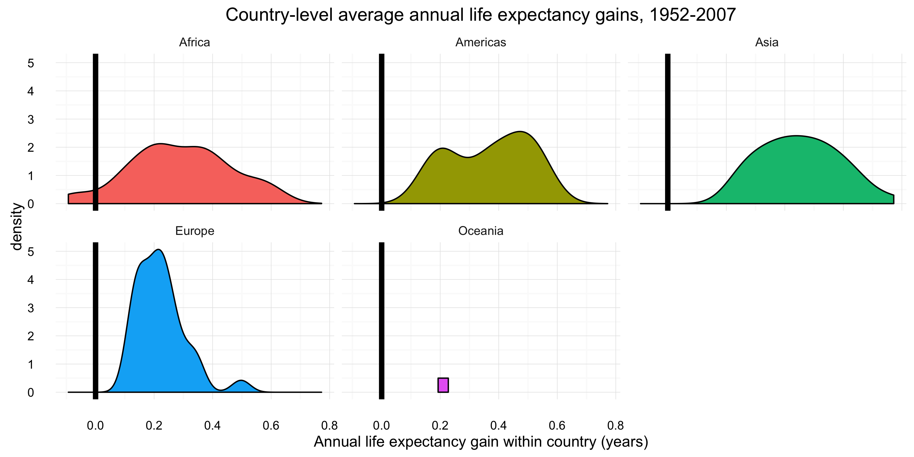

CSSS 508, Week 6
===
author: Rebecca Ferrell
date: May 4, 2016
transition: rotate
width: 1100
height: 750


Goofus approach to data analysis
===
incremental: true


```r
mean1 <- mean(swiss$Fertility)
mean2 <- mean(swiss$Agriculture)
mean3 <- mean(swiss$Examination)
mean4 <- mean(swiss$Fertility)
mean5 <- mean(swiss$Catholic)
mean5 <- mean(swiss$Infant.Mortality)
```


Gallant: Don't Repeat Yourself (DRY)
===
incremental: true

Want to avoid repetition and inconsistencies when:

* For each item in a list, doing the same thing to it
* Partitioning data, fitting same model to each part separately
* Studying behavior of models under many different samples of data
* Importing many similar data files, cleaning up each, gluing them together

Things to identify:

1. What we're looping over
2. What we do in the loop
3. Is what happens in the loop affected by previous iterations?


Programming agenda 
===

Today:

* `dplyr` and `broom`
* `for` and `while` loop programming
* Vectorization to avoid loops

Next week:

* Writing your own functions!
* `dplyr::summarize_each`, `dplyr::mutate_each`
* `lapply`, `replicate`
* `apply`


Looping dplyr-style
===
type: section


Motivating example
===

Say we want to model life expectancy as a function of time within each country in the `gapminder` data. First, we'll start with some exploratory data analysis by sampling 20 countries and looking at trends:


```r
library(gapminder)
library(dplyr)
library(ggplot2)
set.seed(1234)
(rando_countries <- sample(unique(gapminder$country),
                          size = 20, replace = FALSE))
```

```
 [1] Burkina Faso        Myanmar             Morocco             Mozambique          Spain              
 [6] Zambia              Albania             Croatia             Nepal               Kenya              
[11] New Zealand         Kuwait              Dominican Republic  Sri Lanka           Ecuador            
[16] Romania             Trinidad and Tobago Czech Republic      Chile               Congo, Rep.        
142 Levels: Afghanistan Albania Algeria Angola Argentina Australia Austria Bahrain Bangladesh Belgium Benin ... Zimbabwe
```


Life expectancy trends in sample
===


```r
ggplot(gapminder %>% filter(country %in% rando_countries),
       aes(x = year, y = lifeExp, group = country)) +
    geom_line() + geom_smooth(method = "lm", size = 0.5) + facet_wrap( ~ country, nrow = 4)
```


Modeling approach
===

Based on the plot, modeling life expectancy as a linear function of time is a reasonable starting point. Some countries have much steeper trajectories than others (more improvement in life expectancy). Let's fit a linear regression of life expectancy on time *for each country separately* so we get an intercept and slope per country.

To start: let's re-define as years since 1980 for easier interpretation of the regression intercepts (predicted life expectancy in 1980).

```r
gapminder <- gapminder %>%
    mutate(time_1980 = year - 1980)
```


dplyr::do()
===

When the loop involves taking different chunks of your data and doing something with it, the `do` function in the `dplyr` package combined with `group_by` is a nice option.


```r
gapminder_new <- gapminder %>%
    group_by(country, continent) %>%
    do(time_trend = lm(lifeExp ~ time_1980, data = .))
```

Comments:

* We are grouping by both country and continent. Continent isn't really being used because each country belongs to just one continent, but this keeps the variable `continent` on the data.
* The period `.` means "this is where the stuff before the pipe goes in". We haven't been using it because with many functions, data is the first argument to the function.


lm output with do
===


```r
head(gapminder_new, 3)
```

```
Source: local data frame [3 x 3]

      country continent time_trend
       (fctr)    (fctr)      (chr)
1 Afghanistan      Asia    <S3:lm>
2     Albania    Europe    <S3:lm>
3     Algeria    Africa    <S3:lm>
```

The data are not "tidy" yet: our model information is all stuck in an `lm` object in the `time_trend` column. We want to pull out for each country:

* Intercept
* Slope (mean change in life expectancy per year)
* $R^2$ (proportion of variance in life expectancy explained by time)


broom
===

We'll use the `broom` package, which is designed to tidy up `do` output of statistical functions. Install and load `broom`.

```r
# install.packages("broom")
library(broom)
```

`broom` has three key functions that work across a wide array of statistical models:

* `glance`: a single row summary of model fit ($R^2$, etc.)
* `tidy`: gives a tidy representation of a model (coefficients, SEs)
* `augment`: adds columns with predictions, residuals, etc.


glance
===

`broom`'s `glance` function gets some model summaries:


```r
gapminder_glance <- gapminder_new %>%
    glance(time_trend)
head(gapminder_glance, 2)
```

```
Source: local data frame [2 x 13]
Groups: country, continent [2]

      country continent r.squared adj.r.squared    sigma statistic      p.value    df    logLik      AIC      BIC
       (fctr)    (fctr)     (dbl)         (dbl)    (dbl)     (dbl)        (dbl) (int)     (dbl)    (dbl)    (dbl)
1 Afghanistan      Asia 0.9477123     0.9424835 1.222788  181.2494 9.835213e-08     2 -18.34693 42.69387 44.14859
2     Albania    Europe 0.9105778     0.9016355 1.983062  101.8290 1.462763e-06     2 -24.14904 54.29807 55.75279
Variables not shown: deviance (dbl), df.residual (int)
```


tidy
===

`broom`'s `tidy` function extracts coefficients, standard errors, and confidence intervals:


```r
gapminder_tidy <- gapminder_new %>%
    tidy(time_trend, conf.int = TRUE)
head(gapminder_tidy, 4)
```

```
Source: local data frame [4 x 9]
Groups: country, continent [2]

      country continent        term   estimate  std.error statistic      p.value   conf.low  conf.high
       (fctr)    (fctr)       (chr)      (dbl)      (dbl)     (dbl)        (dbl)      (dbl)      (dbl)
1 Afghanistan      Asia (Intercept) 37.6164977 0.35313656 106.52111 1.303138e-16 36.8296604 38.4033350
2 Afghanistan      Asia   time_1980  0.2753287 0.02045093  13.46289 9.835213e-08  0.2297612  0.3208962
3     Albania    Europe (Intercept) 68.6002583 0.57270070 119.78379 4.033976e-17 67.3242016 69.8763149
4     Albania    Europe   time_1980  0.3346832 0.03316639  10.09104 1.462763e-06  0.2607839  0.4085825
```


Un-tidying tidy
===

In this case, the data are maybe *too* tidy: we just want the coefficients and to have them on the same row. Use `tidyr`'s `spread` from last week to modify:


```r
library(tidyr)
gapminder_tidy2 <- gapminder_tidy %>%
    select(country, continent, term, estimate) %>%
    spread(key = term, value = estimate)
head(gapminder_tidy2, 3)
```

```
Source: local data frame [3 x 4]
Groups: country, continent [3]

      country continent (Intercept) time_1980
       (fctr)    (fctr)       (dbl)     (dbl)
1 Afghanistan      Asia    37.61650 0.2753287
2     Albania    Europe    68.60026 0.3346832
3     Algeria    Africa    59.31481 0.5692797
```


augment
===

`broom`'s `augment` function can get residuals for each observation if we want:


```r
gapminder_augment <- gapminder_new %>%
    augment(time_trend)
head(gapminder_augment, 2)
```

```
Source: local data frame [2 x 11]
Groups: country, continent [1]

      country continent lifeExp time_1980  .fitted   .se.fit     .resid      .hat   .sigma   .cooksd .std.resid
       (fctr)    (fctr)   (dbl)     (dbl)    (dbl)     (dbl)      (dbl)     (dbl)    (dbl)     (dbl)      (dbl)
1 Afghanistan      Asia  28.801       -28 29.90729 0.6639995 -1.1062949 0.2948718 1.211813 0.2427205 -1.0774216
2 Afghanistan      Asia  30.332       -23 31.28394 0.5799442 -0.9519382 0.2249417 1.237512 0.1134714 -0.8842813
```


Combining
===

We can use `left_join`s to merge everything of interest:


```r
gapminder_lm_final <- gapminder_tidy2 %>%
    # merge on R^2
    left_join(gapminder_glance %>%
                  ungroup() %>% # removes by-continent grouping
                  # so that continent doesn't appear twice
                  select(country, r.squared),
              by = "country")
head(gapminder_lm_final, 3)
```

```
Source: local data frame [3 x 5]
Groups: country, continent [3]

      country continent (Intercept) time_1980 r.squared
       (fctr)    (fctr)       (dbl)     (dbl)     (dbl)
1 Afghanistan      Asia    37.61650 0.2753287 0.9477123
2     Albania    Europe    68.60026 0.3346832 0.9105778
3     Algeria    Africa    59.31481 0.5692797 0.9851172
```


Possibilities
===

With `gapminder_lm_final`, we can now easily examine:

* Fitted life expectancies in 1980 across countries
* Rate of average life expectancy gains during period across countries
* Countries for which the linear trend fit well (high $R^2$) or didn't (low $R^2$)

Had we kept other variables around, there are many other things we could look at, like regression residual diagnostics.


Example: average gains by continent
===

To make a density plot of average gains by continent:

```r
lifeExp_gains <- ggplot(data = gapminder_lm_final,
       aes(x = time_1980,
           fill = continent)) +
    geom_density() +
    geom_vline(xintercept = 0, size = 2) + 
    facet_wrap( ~ continent) +
    xlab("Annual life expectancy gain within country (years)") +
    ggtitle("Country-level average annual life expectancy gains, 1952-2007") +
    theme_minimal() +
    theme(legend.position = "none") # no legend
```


Average gains by continent plot
===




for loops
===
type: section


for loops
===
incremental: true

`for` loops are most basic and general kind of loop. You give it a vector of indices, it assigns to first value to some variable, does stuff, increments the variable to the next value, and keeps going doing more stuff until it runs out of indices.


```r
for(i in 1:3) {
    # inside for, output won't show up w/o "print"
    print(i^2) 
}
```

```
[1] 1
[1] 4
[1] 9
```

Iterating over indices `1:n` is very common. `n` might be a vector length or number of rows/columns in matrix or data frame.


Iterate over character vectors
===
incremental: true

You can also iterate over a character vector:

```r
some_letters <- letters[4:7]
for(i in some_letters) {
    print(i)
}
```

```
[1] "d"
[1] "e"
[1] "f"
[1] "g"
```

```r
i # the index variable was added to environment
```

```
[1] "g"
```


seq_along
===
incremental: true

When you want to loop over something that isn't numeric but want to have a numeric index of where you are in the loop, `seq_along` is useful:


```r
for(a in seq_along(some_letters)) {
    print(paste0("Letter ", a, ": ", some_letters[a]))
}
```

```
[1] "Letter 1: d"
[1] "Letter 2: e"
[1] "Letter 3: f"
[1] "Letter 4: g"
```

```r
a
```

```
[1] 4
```


Pre-allocation
===
incremental: true

Usually in a `for` loop, you aren't printing output, but want to store results from each iteration somewhere. Figure out how you want to store the output (vector, matrix, data frame, list, etc.) and then **pre-allocate** an object of the right size for that (typically with missing values as placeholders).


```r
# preallocate vector of NAs
iters <- 5
output <- rep(NA, iters)

for(i in 1:iters) {
    output[i] <- (i-1)^2 + (i-2)^2
}
output
```

```
[1]  1  1  5 13 25
```


Preallocated list: regression models
===
incremental: true


```r
x <- rnorm(30) # making fake data
fake_data <- data.frame(x = x, y = 2 * x + rnorm(30))
# model formulas as strings in named vector
models <- c("int only" = "y ~ 1", "standard" = "y ~ x")
output <- vector("list", length(models)) # empty list
names(output) <- names(models)
# fit each model to fake_data and store in output
for(mod in names(models)) {
    output[[mod]] <- lm(formula(models[mod]),
                        data = fake_data)
}
str(output)
```

```
List of 2
 $ int only:List of 11
  ..$ coefficients : Named num -0.939
  .. ..- attr(*, "names")= chr "(Intercept)"
  ..$ residuals    : Named num [1:30] 1.434 -2.127 -1.469 0.787 1.864 ...
  .. ..- attr(*, "names")= chr [1:30] "1" "2" "3" "4" ...
  ..$ effects      : Named num [1:30] 5.143 -2.348 -1.69 0.566 1.642 ...
  .. ..- attr(*, "names")= chr [1:30] "(Intercept)" "" "" "" ...
  ..$ rank         : int 1
  ..$ fitted.values: Named num [1:30] -0.939 -0.939 -0.939 -0.939 -0.939 ...
  .. ..- attr(*, "names")= chr [1:30] "1" "2" "3" "4" ...
  ..$ assign       : int 0
  ..$ qr           :List of 5
  .. ..$ qr   : num [1:30, 1] -5.477 0.183 0.183 0.183 0.183 ...
  .. .. ..- attr(*, "dimnames")=List of 2
  .. .. .. ..$ : chr [1:30] "1" "2" "3" "4" ...
  .. .. .. ..$ : chr "(Intercept)"
  .. .. ..- attr(*, "assign")= int 0
  .. ..$ qraux: num 1.18
  .. ..$ pivot: int 1
  .. ..$ tol  : num 1e-07
  .. ..$ rank : int 1
  .. ..- attr(*, "class")= chr "qr"
  ..$ df.residual  : int 29
  ..$ call         : language lm(formula = formula(models[mod]), data = fake_data)
  ..$ terms        :Classes 'terms', 'formula' length 3 y ~ 1
  .. .. ..- attr(*, "variables")= language list(y)
  .. .. ..- attr(*, "factors")= int(0) 
  .. .. ..- attr(*, "term.labels")= chr(0) 
  .. .. ..- attr(*, "order")= int(0) 
  .. .. ..- attr(*, "intercept")= int 1
  .. .. ..- attr(*, "response")= int 1
  .. .. ..- attr(*, ".Environment")=<environment: R_GlobalEnv> 
  .. .. ..- attr(*, "predvars")= language list(y)
  .. .. ..- attr(*, "dataClasses")= Named chr "numeric"
  .. .. .. ..- attr(*, "names")= chr "y"
  ..$ model        :'data.frame':	30 obs. of  1 variable:
  .. ..$ y: num [1:30] 0.495 -3.065 -2.408 -0.152 0.925 ...
  .. ..- attr(*, "terms")=Classes 'terms', 'formula' length 3 y ~ 1
  .. .. .. ..- attr(*, "variables")= language list(y)
  .. .. .. ..- attr(*, "factors")= int(0) 
  .. .. .. ..- attr(*, "term.labels")= chr(0) 
  .. .. .. ..- attr(*, "order")= int(0) 
  .. .. .. ..- attr(*, "intercept")= int 1
  .. .. .. ..- attr(*, "response")= int 1
  .. .. .. ..- attr(*, ".Environment")=<environment: R_GlobalEnv> 
  .. .. .. ..- attr(*, "predvars")= language list(y)
  .. .. .. ..- attr(*, "dataClasses")= Named chr "numeric"
  .. .. .. .. ..- attr(*, "names")= chr "y"
  ..- attr(*, "class")= chr "lm"
 $ standard:List of 12
  ..$ coefficients : Named num [1:2] -0.0901 2.0015
  .. ..- attr(*, "names")= chr [1:2] "(Intercept)" "x"
  ..$ residuals    : Named num [1:30] 1.54 -0.977 -0.764 -0.191 -0.906 ...
  .. ..- attr(*, "names")= chr [1:30] "1" "2" "3" "4" ...
  ..$ effects      : Named num [1:30] 5.143 9.715 -0.925 -0.54 -1.455 ...
  .. ..- attr(*, "names")= chr [1:30] "(Intercept)" "x" "" "" ...
  ..$ rank         : int 2
  ..$ fitted.values: Named num [1:30] -1.0452 -2.0883 -1.6437 0.0389 1.8303 ...
  .. ..- attr(*, "names")= chr [1:30] "1" "2" "3" "4" ...
  ..$ assign       : int [1:2] 0 1
  ..$ qr           :List of 5
  .. ..$ qr   : num [1:30, 1:2] -5.477 0.183 0.183 0.183 0.183 ...
  .. .. ..- attr(*, "dimnames")=List of 2
  .. .. .. ..$ : chr [1:30] "1" "2" "3" "4" ...
  .. .. .. ..$ : chr [1:2] "(Intercept)" "x"
  .. .. ..- attr(*, "assign")= int [1:2] 0 1
  .. ..$ qraux: num [1:2] 1.18 1.12
  .. ..$ pivot: int [1:2] 1 2
  .. ..$ tol  : num 1e-07
  .. ..$ rank : int 2
  .. ..- attr(*, "class")= chr "qr"
  ..$ df.residual  : int 28
  ..$ xlevels      : Named list()
  ..$ call         : language lm(formula = formula(models[mod]), data = fake_data)
  ..$ terms        :Classes 'terms', 'formula' length 3 y ~ x
  .. .. ..- attr(*, "variables")= language list(y, x)
  .. .. ..- attr(*, "factors")= int [1:2, 1] 0 1
  .. .. .. ..- attr(*, "dimnames")=List of 2
  .. .. .. .. ..$ : chr [1:2] "y" "x"
  .. .. .. .. ..$ : chr "x"
  .. .. ..- attr(*, "term.labels")= chr "x"
  .. .. ..- attr(*, "order")= int 1
  .. .. ..- attr(*, "intercept")= int 1
  .. .. ..- attr(*, "response")= int 1
  .. .. ..- attr(*, ".Environment")=<environment: R_GlobalEnv> 
  .. .. ..- attr(*, "predvars")= language list(y, x)
  .. .. ..- attr(*, "dataClasses")= Named chr [1:2] "numeric" "numeric"
  .. .. .. ..- attr(*, "names")= chr [1:2] "y" "x"
  ..$ model        :'data.frame':	30 obs. of  2 variables:
  .. ..$ y: num [1:30] 0.495 -3.065 -2.408 -0.152 0.925 ...
  .. ..$ x: num [1:30] -0.4772 -0.9984 -0.7763 0.0645 0.9595 ...
  .. ..- attr(*, "terms")=Classes 'terms', 'formula' length 3 y ~ x
  .. .. .. ..- attr(*, "variables")= language list(y, x)
  .. .. .. ..- attr(*, "factors")= int [1:2, 1] 0 1
  .. .. .. .. ..- attr(*, "dimnames")=List of 2
  .. .. .. .. .. ..$ : chr [1:2] "y" "x"
  .. .. .. .. .. ..$ : chr "x"
  .. .. .. ..- attr(*, "term.labels")= chr "x"
  .. .. .. ..- attr(*, "order")= int 1
  .. .. .. ..- attr(*, "intercept")= int 1
  .. .. .. ..- attr(*, "response")= int 1
  .. .. .. ..- attr(*, ".Environment")=<environment: R_GlobalEnv> 
  .. .. .. ..- attr(*, "predvars")= language list(y, x)
  .. .. .. ..- attr(*, "dataClasses")= Named chr [1:2] "numeric" "numeric"
  .. .. .. .. ..- attr(*, "names")= chr [1:2] "y" "x"
  ..- attr(*, "class")= chr "lm"
```


Conditional flow
===
type: section

if, else
===
type: incremental

You've seen `ifelse` before for logical checks on a whole vector. For checking whether a single condition holds and doing more complex actions, you can use `if()` and `else`:


```r
for(i in 1:10) {
    if(i %% 2 == 0) {
        print(paste0("The number ", i, " is even"))
    } else if(i %% 3 == 0) {
        print(paste0("The number ", i, " is divisible by 3"))
    } else {
        print(paste0("The number ", i, " is not divisible by 2 or 3"))
    }
}
```

**Warning!** `else` needs to be on same line as the closing brace `}` of previous `if()`.


if, else: simple example
===
incremental: true


```
[1] "The number 1 is not divisible by 2 or 3"
[1] "The number 2 is even"
[1] "The number 3 is not even but divisible by 3"
[1] "The number 4 is even"
[1] "The number 5 is not divisible by 2 or 3"
[1] "The number 6 is even"
[1] "The number 7 is not divisible by 2 or 3"
[1] "The number 8 is even"
[1] "The number 9 is not even but divisible by 3"
[1] "The number 10 is even"
```


while loops
===
incremental: true

Another looping structure is the `while` loop. Rather than iterating over a predefined vector, the loop keeps going until some condition is no longer true.


```r
num_heads <- 0; num_flips <- 0
while(num_heads < 4) {
    coin_flip <- rbinom(n = 1, size = 1, prob = 0.5)
    if(coin_flip == 1) { num_heads <- num_heads + 1 }
    num_flips <- num_flips + 1
}
num_heads
```

```
[1] 4
```

```r
num_flips # follows negative binomial distribution
```

```
[1] 7
```


Difficult real-world example
===
type: section

Importing many files
===

Let us journey into...**data hell!**


[California Office of Statewide Health Planning and Development Hospital Quarterly Financial and Utilization Data Files](http://oshpd.ca.gov/hid/Products/Hospitals/QuatrlyFinanData/CmpleteData/default.asp)


Data prep sketch outline
===
incremental: true

- Pre-allocate a list for the individual files
- Inside a `for` loop `seq_along`ing the file names:
    + Make a URL and download file 
    + Read the file in with Excel-reading package and store in list
- Use `dplyr::bind_rows` to combine all tables into one
- Remove the list to save memory
- Clean up the combined data
- Some variations on general process you might encounter:
    + Unzip files first (`unzip`)
    + Use `if` logic to clean up data differently depending on file

**HOMEWORK**: read the [extended writeup on the course page](https://rebeccaferrell.github.io/Lectures/data_download_demo.html).


Vectorization
===
type: section

Non-vectorized example
===

We have a vector of numbers, and we want to add 1 to each element.

```r
my_vector <- rnorm(100000)
```

A `for` loop approach works but is slow:

```r
for_start <- proc.time()
new_vector <- rep(NA, length(my_vector))
for(position in 1:length(my_vector)) {
    new_vector[position] <- my_vector[position] + 1
}
(for_time <- proc.time() - for_start)
```

```
   user  system elapsed 
  0.216   0.011   0.252 
```


Vectorization wins
===

Recognize that we can instead use R's vector addition (with recycling):

```r
vec_start <- proc.time()
new_vector <- my_vector + 1
(vec_time <- proc.time() - vec_start)
```

```
   user  system elapsed 
  0.004   0.000   0.005 
```

```r
for_time / vec_time
```

```
   user  system elapsed 
   54.0     Inf    50.4 
```

Vector/matrix arithmetic is implemented using fast, optimized functions that a `for` loop can't compete with.


Vectorization examples
===
incremental: true

* `rowSums`, `colSums`, rowMeans`, `colMeans` give sums or averages over rows or columns of matrices/data frames


```r
(a_matrix <- matrix(1:12, nrow = 3, ncol = 4))
```

```
     [,1] [,2] [,3] [,4]
[1,]    1    4    7   10
[2,]    2    5    8   11
[3,]    3    6    9   12
```

```r
rowSums(a_matrix)
```

```
[1] 22 26 30
```


More vectorization examples
===
incremental: true

* `cumsum`, `cumprod`, `cummin`, `cummax` give back a vector with cumulative quantities (e.g. running totals)

```r
cumsum(1:7)
```

```
[1]  1  3  6 10 15 21 28
```

* `pmax` and `pmin` take a matrix or set of vectors, output the min or max for each **p**osition (after recycling):

```r
pmax(c(0, 2, 4), c(1, 1, 1), c(2, 2, 2))
```

```
[1] 2 2 4
```


Lab exercise
===
type: section


Cross validation
===

**Cross validation* is a way of assessing how well models fit your data
take some data, partition into folds, fit model, save predictions for left-out data, look at how those predictions do. then do for more models (maybe increasing polynomial terms using `poly`), so we'll have nested loops.

for more info: [Introduction to Statistical Learning](http://www-bcf.usc.edu/~gareth/ISL/), Chapter 5.

Homework
===
type: section

Read the [data downloading demonstration on the course page](https://rebeccaferrell.github.io/Lectures/data_download_demo.html). I hope that your forays into automated data downloading and cleaning are smoother than this one was!
